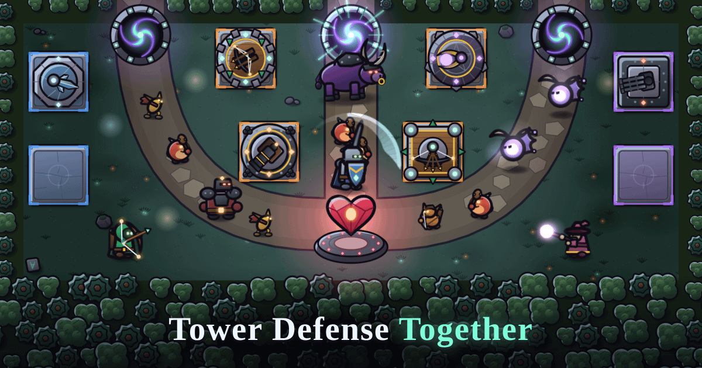

# Press kit and first impression

What a stranger sees before they play: the link preview, the screenshots and clip in a post, and the first load on a phone. The channels and their tags are in [`ANALYTICS.md`](ANALYTICS.md); the art rules for the card and the splash are in [`ART.md`](ART.md) §14.

## 1. The pitch and the link preview

**The pitch** is README.md's line 3, word for word. Use it in posts and store fields; don't write a new one per channel.

> A browser co-op tower defense for 1–3 players (one per lane): build towers, control a hero and hold the Heart against waves of creeps.

**The link preview.** `apps/client/index.html` carries the tags every site reads (`test/linkPreview.test.ts` checks them):

| Tag | Value |
|---|---|
| `og:title`, `twitter:title` | Tower Defense Together |
| `og:description`, `twitter:description`, `<meta name="description">` | the pitch above |
| `og:image`, `twitter:image` | `https://tgt-td-cld.vercel.app/og-card.png` (1200 × 630, PNG, with `og:image:alt` / `twitter:image:alt`) |
| `og:url`, `<link rel="canonical">` | `https://tgt-td-cld.vercel.app/` |
| `og:type`, `og:site_name`, `twitter:card` | `website`, Tower Defense Together, `summary_large_image` |



The card is drawn from the game's own art (`?ogcard` on the dev server). To change it, edit `apps/client/src/ogCard.ts`, run `npm run og -w @tdt/client`, look at the PNG and commit it (ART.md §14).

## 2. Four screenshots

Phone-size, portrait, the way most players will see the game. Take them on a real phone or in Chrome DevTools' device mode:

1. `npm run dev` (solo) or the production URL. Open DevTools → **Toggle device toolbar** (Ctrl/Cmd + Shift + M) → pick **Pixel 7** (412 × 915) or **iPhone 12 Pro** (390 × 844, the same screen as an iPhone 13). Keep the device pixel ratio the preset gives (2.625 / 3), so a capture is sharp.
2. Capture with DevTools' **⋮ → Capture screenshot** (the device frame off). Not "full size": the game is one screen.
3. Display **Normal** (⚙ → Display). Bright is for washed-out phone screens and looks flat in a post.

The four:

| # | Where | What to show |
|---|---|---|
| 1 | Solo, **Quick**, Normal, wave 3–4 (build phase between waves) | The whole Spire map: towers on your pads, your hero by a lane, gold and the wave timer in the top bar. Tap a tower so its ring shows. |
| 2 | Same match, **wave 5 or 10** (a boss wave) | The boss on a lane with its banner, towers firing, the hero fighting. Wave 5 also brings the first Wisps. |
| 3 | `/?practice=meteor-rain` → **Practice Meteor Rain** (Ranger or Arcanist) | Cast R as a wave arrives: the ally casts onto yours and the lanes fill with the **Meteor Rain** strikes and the combo ribbon. Capture as the strikes land. |
| 4 | The **end screen** of a won Quick match | The beating Heart emblem, "Victory!" and the match stats. |

For a store page or a press post, add one from `/?showcase`: the **Heroes** cards (Ranger, Warden, Arcanist) or the **Towers** cards (tier 3 and a branch), in Normal, with the device toolbar at the same phone. The showcase is a dev page: crop to the cards, not the page header.

Skip the first-match lesson (it starts on a new player's first solo match) with **Skip**, or use a browser profile that has already played.

## 3. A 15-second clip

One take from a real match, about 15 s, portrait, sound on (Reddit and X autoplay muted, so the picture has to carry it):

- **0–4 s:** build phase: place a tower and upgrade one (the radial menu on a phone).
- **4–10 s:** a wave hits: towers firing, the hero fighting on a lane (a boss wave if you can).
- **10–15 s:** the ultimate: Arrow Storm or Meteor raining on all three lanes, or the Meteor Rain combo from `/?practice=meteor-rain`, with the kill count.

**Recording:**

- **iPhone:** Control Centre → **Screen Recording** (add it in Settings → Control Centre if it's missing). Turn on a **Focus** (Do Not Disturb) first so no banner lands in the clip. The game's sound is recorded; the silent switch mutes it (the game plays as ambient audio).
- **Android:** Quick Settings → **Screen record** → "Record audio: Device audio", and turn on **Do Not Disturb**.
- **Desktop:** DevTools device mode at Pixel 7 or iPhone 12 Pro, then the OS recorder on that area: macOS **Cmd + Shift + 5** (record a selected portion), Windows **Win + Shift + R** (Snipping Tool) or **Win + Alt + R** (Xbox Game Bar, whole window), or OBS. Close other tabs and silence notifications (macOS Focus, Windows Do not disturb).

**Trimming:** on the phone, Photos → Edit → drag the ends; or on a computer with ffmpeg (H.264 + AAC plays everywhere):

```bash
ffmpeg -ss 00:01:05 -i recording.mov -t 15 -vf "scale=-2:1280" -c:v libx264 -crf 23 -preset slow \
  -pix_fmt yuv420p -c:a aac -b:a 128k -movflags +faststart clip.mp4
```

`-ss` is where the clip starts, `-t 15` its length, `scale=-2:1280` a 1280 px tall portrait (most sites re-encode bigger files anyway).

## 4. Tagged links and checking the card

Every post uses its channel's link (ANALYTICS.md), so the dashboard can tell the channels apart:

| Where | Link |
|---|---|
| r/PlayMyGame | `https://tgt-td-cld.vercel.app/?src=reddit-playmygame` |
| r/incremental_games | `https://tgt-td-cld.vercel.app/?src=reddit-incremental` |
| r/cozygames | `https://tgt-td-cld.vercel.app/?src=reddit-cozy` |
| CrazyGames | `https://tgt-td-cld.vercel.app/?src=crazygames` |

A tagged link shows the same card as the bare URL: the tags are in `index.html` for every query string, the canonical URL is a tag only, and the page never rewrites its address, so `?src=` reaches the analytics (`e2e/platform.spec.ts` and `test/linkPreview.test.ts` check both).

**After each deploy that changes the card or the tags**, check the preview before posting:

- **Facebook Sharing Debugger** (https://developers.facebook.com/tools/debug/): paste the tagged link, **Scrape Again**; it lists every `og:` tag it read and shows the card. Facebook, Messenger and WhatsApp use what it caches.
- **LinkedIn Post Inspector** (https://www.linkedin.com/post-inspector/): the same for LinkedIn.
- **opengraph.xyz** (https://www.opengraph.xyz/): previews Facebook, X, LinkedIn and Discord side by side.
- **Discord and Reddit:** paste the link into a private channel or a draft post; X has no validator any more, so use a draft post there too.

The image URL is the production one, so a Vercel **preview** deploy shows the production card (or none, before the first deploy that has `og-card.png`). Crawlers cache the image by URL for days to weeks: a new card needs a **new file name** (`og-card-2.png`, both tags) to reach links that were already shared, then a re-scrape in the debuggers above.

## 5. First load on a phone

How long a stranger on a slow phone waits before they can play. Measured with `npm run first-load -w @tdt/client` (`apps/client/scripts/firstLoad.ts`), never estimated.

**Method.** The script builds the production client with a placeholder game server (`VITE_SERVER_URL=wss://example.invalid`, so the online home card renders exactly as in production; the home card opens no WebSocket until Create or Join) into `apps/client/dist-firstload`, serves it with `vite preview`, and loads `/` in headless Chromium (Playwright) as a **Pixel 7** (412 × 839 viewport, DPR 2.625, touch) with:

- **Lighthouse's mobile throttling ("Slow 4G")** through CDP `Network.emulateNetworkConditions`: **562.5 ms latency, 1474.56 kbps down, 675 kbps up** (Lighthouse's 150 ms RTT / 1.6 Mbps / 750 kbps, as DevTools applies them), plus `Emulation.setCPUThrottlingRate` **4×**;
- a **cold cache** (a fresh browser context per run and `Network.setCacheDisabled`) and **service workers blocked**;
- analytics posts blocked, so measurement visits never reach the rollout dashboard.

It records the **first contentful paint** (on this branch, the boot splash), main.ts's **`tdt:ready`** mark (the first screen is up), and **usable**: `<html data-ready>` is set, the home card is shown, and **Play solo** is enabled, on screen and the element a tap at its centre would hit. If Play solo never comes on screen, the run says so and where the button is. Flags: `--runs N` (default 5), `--no-build`, `--url <page>` (measure a deployed build instead), `--latency`, `--down`, `--up`, `--cpu`.

**Results, 3 Oct 2026** (Playwright 1.56.1, Chromium headless, Node 22.14, a 4-core Intel Xeon VM; CPU 4× slower than that machine):

| Build | Runs | First contentful paint | `tdt:ready` | Usable (Play solo tappable) | Transferred |
|---|---|---|---|---|---|
| This branch (`cursor/link-preview-first-load-1287`, local `vite preview`) | 7 | median **1.56 s** (1.54–1.59 s), the splash | median 3.93 s (3.91–3.99 s) | median **4.50 s** (4.49–4.62 s) | 302 KB |
| Production before it (https://tgt-td-cld.vercel.app/, `--url`) | 5 | median 1.64 s (1.61–1.67 s), the bare HUD markup | median 4.05 s (4.04–4.11 s) | **never**: Play solo's top at 830 px of 839, below the fold | 315 KB |

The production row is a baseline, not a like-for-like timing: it went over the real internet to Vercel on top of the emulated network. What it shows is the layout: before this change a new player on a Pixel 7 (and an iPhone 13) had to scroll to find Play solo, and the first paint was the in-match HUD markup ("WAVE 0 / 10", a hero bar) rather than the title.

Where the time goes on this branch: the HTML arrives at about 1.1 s (two round trips at 562.5 ms), the render-blocking stylesheet holds the splash until about 1.56 s, the scripts (the main bundle is ~200 KB compressed) load and run by 3.9 s, and the game view's first Pixi frame behind the lobby is one long task (~0.57 s at 4× CPU) before the button can take a tap. Re-run the script after changing the bundle size, the boot path or the home card, and update this table.
